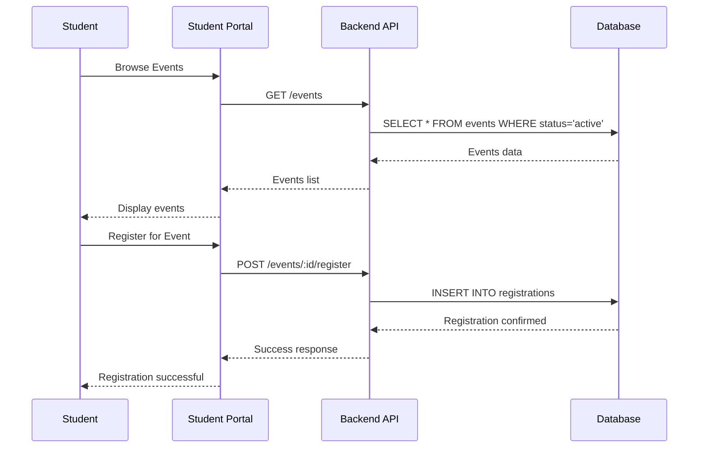
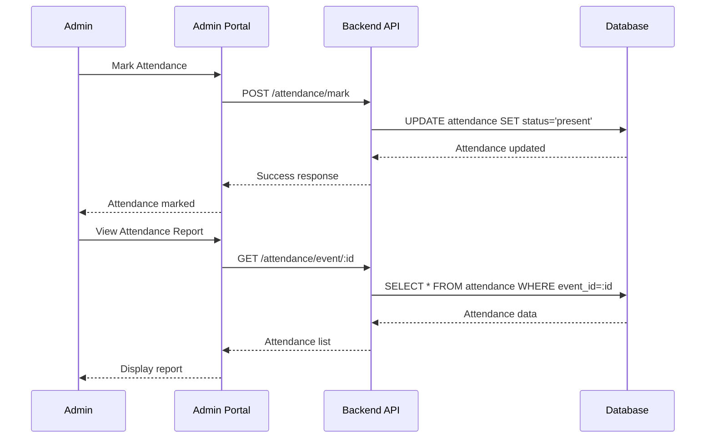
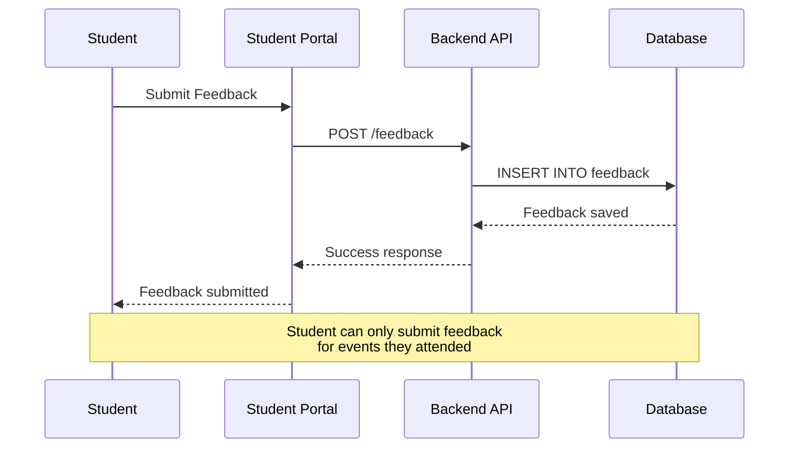
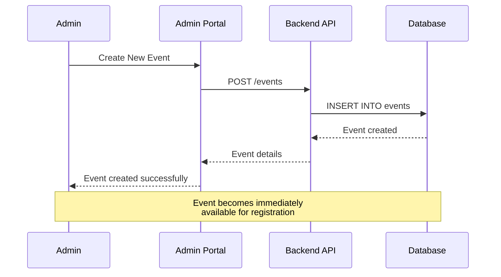

# Campus Events Management System - Design Document

## Table of Contents
1. [Project Overview](#project-overview)
2. [Data to Track](#data-to-track)
3. [Database Schema](#database-schema)
4. [API Design](#api-design)
5. [Workflows](#workflows)
6. [Assumptions & Edge Cases](#assumptions--edge-cases)
7. [Technology Stack](#technology-stack)
8. [Architecture Overview](#architecture-overview)

---

## Project Overview

The Campus Events Management System is a web application designed to manage campus events including hackathons, workshops, tech talks, and fests. The system provides separate portals for administrators and students with distinct functionalities.

### Key Features
- **Admin Portal**: Event creation, attendance management, analytics dashboard, report generation
- **Student Portal**: Event browsing, registration, check-in, feedback submission
- **Real-time Analytics**: Attendance tracking, event performance metrics
- **Feedback System**: Student feedback collection and analysis

---

## Data to Track

### 1. Event Creation
- **Event Details**: Title, description, type (hackathon/workshop/tech_talk/fest), date, time, venue
- **Capacity Management**: Maximum attendees, current registrations
- **Event Status**: Active, cancelled, completed
- **Organizer Information**: Admin who created the event

### 2. Student Registration
- **Student Information**: Student ID, name, contact details
- **Registration Data**: Event ID, registration timestamp, status
- **Registration History**: Track all past and current registrations

### 3. Attendance Tracking
- **Check-in Data**: Student ID, event ID, check-in timestamp
- **Check-out Data**: Check-out timestamp (optional)
- **Attendance Status**: Present, absent, late
- **Attendance Analytics**: Attendance rates, patterns

### 4. Feedback Collection
- **Rating System**: 1-5 star rating scale
- **Feedback Comments**: Text feedback from students
- **Feedback Metadata**: Submission timestamp, event context
- **Feedback Analytics**: Average ratings, sentiment analysis

---

## Database Schema

### Entity Relationship Diagram

```
┌─────────────────┐    ┌─────────────────┐    ┌─────────────────┐
│     Students    │    │     Events      │    │   Registrations │
├─────────────────┤    ├─────────────────┤    ├─────────────────┤
│ id (PK)         │    │ id (PK)         │    │ id (PK)         │
│ student_id      │◄───┤ title           │◄───┤ student_id (FK) │
│ name            │    │ description     │    │ event_id (FK)   │
│ email           │    │ event_type      │    │ registered_at   │
│ phone           │    │ event_date      │    │ status          │
│ created_at      │    │ start_time      │    └─────────────────┘
└─────────────────┘    │ end_time        │             │
                       │ venue           │             │
                       │ capacity        │             ▼
                       │ status          │    ┌─────────────────┐
                       │ created_by      │    │   Attendance    │
                       │ created_at      │    ├─────────────────┤
                       └─────────────────┘    │ id (PK)         │
                                              │ student_id (FK) │
                                              │ event_id (FK)   │
                                              │ check_in_time   │
                                              │ check_out_time  │
                                              │ status          │
                                              └─────────────────┘
                                                      │
                                                      ▼
                                             ┌─────────────────┐
                                             │    Feedback     │
                                             ├─────────────────┤
                                             │ id (PK)         │
                                             │ student_id (FK) │
                                             │ event_id (FK)   │
                                             │ rating          │
                                             │ comments        │
                                             │ submitted_at    │
                                             └─────────────────┘
```

### Table Definitions

#### Students Table
```sql
CREATE TABLE students (
    id INTEGER PRIMARY KEY AUTOINCREMENT,
    student_id VARCHAR(50) UNIQUE NOT NULL,
    name VARCHAR(100) NOT NULL,
    email VARCHAR(100) UNIQUE NOT NULL,
    phone VARCHAR(20),
    created_at DATETIME DEFAULT CURRENT_TIMESTAMP
);
```

#### Events Table
```sql
CREATE TABLE events (
    id INTEGER PRIMARY KEY AUTOINCREMENT,
    title VARCHAR(200) NOT NULL,
    description TEXT,
    event_type ENUM('hackathon', 'workshop', 'tech_talk', 'fest') NOT NULL,
    event_date DATE NOT NULL,
    start_time TIME NOT NULL,
    end_time TIME NOT NULL,
    venue VARCHAR(200) NOT NULL,
    capacity INTEGER NOT NULL,
    status ENUM('active', 'cancelled', 'completed') DEFAULT 'active',
    created_by INTEGER,
    created_at DATETIME DEFAULT CURRENT_TIMESTAMP
);
```

#### Registrations Table
```sql
CREATE TABLE registrations (
    id INTEGER PRIMARY KEY AUTOINCREMENT,
    student_id INTEGER NOT NULL,
    event_id INTEGER NOT NULL,
    registered_at DATETIME DEFAULT CURRENT_TIMESTAMP,
    status ENUM('registered', 'cancelled') DEFAULT 'registered',
    FOREIGN KEY (student_id) REFERENCES students(id),
    FOREIGN KEY (event_id) REFERENCES events(id),
    UNIQUE(student_id, event_id)
);
```

#### Attendance Table
```sql
CREATE TABLE attendance (
    id INTEGER PRIMARY KEY AUTOINCREMENT,
    student_id INTEGER NOT NULL,
    event_id INTEGER NOT NULL,
    check_in_time DATETIME,
    check_out_time DATETIME,
    status ENUM('present', 'absent', 'late') DEFAULT 'absent',
    FOREIGN KEY (student_id) REFERENCES students(id),
    FOREIGN KEY (event_id) REFERENCES events(id),
    UNIQUE(student_id, event_id)
);
```

#### Feedback Table
```sql
CREATE TABLE feedback (
    id INTEGER PRIMARY KEY AUTOINCREMENT,
    student_id INTEGER NOT NULL,
    event_id INTEGER NOT NULL,
    rating INTEGER CHECK (rating >= 1 AND rating <= 5),
    comments TEXT,
    submitted_at DATETIME DEFAULT CURRENT_TIMESTAMP,
    FOREIGN KEY (student_id) REFERENCES students(id),
    FOREIGN KEY (event_id) REFERENCES events(id),
    UNIQUE(student_id, event_id)
);
```

---

## API Design

### Base URL
```
http://localhost:5000/api
```

### Authentication
- Simple student ID-based authentication for demo purposes
- Admin access through dedicated admin routes

### Endpoints

#### Events Management

**GET /events**
- Description: Retrieve all active events
- Response: Array of event objects
- Example Response:
```json
{
  "events": [
    {
      "id": 1,
      "title": "React Workshop",
      "description": "Learn React fundamentals",
      "event_type": "workshop",
      "event_date": "2024-01-15",
      "start_time": "10:00:00",
      "end_time": "12:00:00",
      "venue": "Computer Lab 1",
      "capacity": 30,
      "registration_count": 15,
      "status": "active"
    }
  ]
}
```

**POST /events**
- Description: Create a new event (Admin only)
- Request Body:
```json
{
  "title": "New Workshop",
  "description": "Workshop description",
  "event_type": "workshop",
  "event_date": "2024-01-20",
  "start_time": "10:00:00",
  "end_time": "12:00:00",
  "venue": "Lab 2",
  "capacity": 25
}
```

**GET /events/:id**
- Description: Get specific event details
- Response: Single event object

#### Student Registration

**POST /events/:id/register**
- Description: Register student for an event
- Request Body:
```json
{
  "student_id": 1
}
```

**GET /students/:id/registrations**
- Description: Get student's registration history
- Response: Array of registration objects

#### Attendance Management

**POST /attendance/mark**
- Description: Mark student attendance (Admin only)
- Request Body:
```json
{
  "student_id": 1,
  "event_id": 1,
  "status": "present"
}
```

**GET /attendance/event/:id**
- Description: Get attendance list for an event
- Response: Array of attendance records

#### Feedback System

**POST /feedback**
- Description: Submit event feedback
- Request Body:
```json
{
  "student_id": 1,
  "event_id": 1,
  "rating": 5,
  "comments": "Great event!"
}
```

**GET /feedback/event/:id**
- Description: Get feedback for an event
- Response: Array of feedback objects

#### Reports & Analytics

**GET /reports/dashboard**
- Description: Get admin dashboard summary
- Response:
```json
{
  "summary": {
    "total_events": 10,
    "total_students": 150,
    "total_registrations": 300,
    "overall_attendance_rate": 85,
    "average_rating": 4.2,
    "most_popular_event_type": "workshop",
    "total_attendance": 255
  },
  "recent_activity": [
    {
      "student_name": "John Doe",
      "event_title": "React Workshop",
      "registered_at": "2024-01-10T10:30:00Z"
    }
  ]
}
```

**GET /reports/events**
- Description: Get detailed event reports
- Query Parameters: `?type=all&start_date=2024-01-01&end_date=2024-12-31`

---

## Workflows

### 1. Student Registration Workflow



### 2. Attendance Marking Workflow



### 3. Feedback Collection Workflow



### 4. Event Creation Workflow



---

## Assumptions & Edge Cases

### Assumptions

1. **Student Authentication**: Using simple student ID for demo purposes
2. **Single Admin**: One admin account manages all events
3. **Event Capacity**: Events have fixed capacity limits
4. **Time Zones**: All times are in local timezone
5. **Registration Window**: Students can register until event capacity is full
6. **Attendance Window**: Attendance can be marked on the event day
7. **Feedback Window**: Students can provide feedback after attending an event

### Edge Cases Handled

#### 1. Duplicate Registrations
- **Scenario**: Student tries to register for the same event twice
- **Solution**: Database constraint prevents duplicate registrations
- **Implementation**: UNIQUE constraint on (student_id, event_id) in registrations table

#### 2. Event Capacity Overflow
- **Scenario**: More students try to register than event capacity
- **Solution**: Check capacity before allowing registration
- **Implementation**: Validation in registration endpoint

#### 3. Missing Feedback
- **Scenario**: Student attends event but doesn't provide feedback
- **Solution**: Feedback is optional, not mandatory
- **Implementation**: NULL values allowed in feedback table

#### 4. Cancelled Events
- **Scenario**: Event gets cancelled after students have registered
- **Solution**: Update event status and notify students
- **Implementation**: Event status field with 'cancelled' state

#### 5. Late Check-ins
- **Scenario**: Student arrives after event start time
- **Solution**: Mark as 'late' attendance status
- **Implementation**: Compare check-in time with event start time

#### 6. No-show Students
- **Scenario**: Student registers but doesn't attend
- **Solution**: Default attendance status is 'absent'
- **Implementation**: Attendance record created with 'absent' status

#### 7. Event Date Conflicts
- **Scenario**: Student tries to register for overlapping events
- **Solution**: Allow registration (student's choice)
- **Implementation**: No automatic conflict detection

#### 8. Invalid Event Data
- **Scenario**: Admin creates event with invalid data
- **Solution**: Server-side validation
- **Implementation**: Input validation in event creation endpoint

#### 9. Database Connection Issues
- **Scenario**: Database becomes unavailable
- **Solution**: Error handling and user-friendly messages
- **Implementation**: Try-catch blocks in API endpoints

#### 10. Concurrent Registrations
- **Scenario**: Multiple students register simultaneously
- **Solution**: Database transactions ensure data consistency
- **Implementation**: SQLite handles concurrent access

---

## Technology Stack

### Frontend
- **React.js**: User interface framework
- **Tailwind CSS**: Styling and responsive design
- **JavaScript (ES6+)**: Programming language

### Backend
- **Node.js**: Server runtime environment
- **Express.js**: Web application framework
- **SQLite**: Lightweight database
- **JavaScript**: Server-side programming

### Development Tools
- **npm**: Package management
- **Git**: Version control
- **VS Code**: Development environment

---

## Architecture Overview

### System Architecture
```
┌─────────────────┐    ┌─────────────────┐    ┌─────────────────┐
│   Student       │    │   Admin         │    │   Database      │
│   Portal        │    │   Portal        │    │   (SQLite)      │
│   (React)       │    │   (React)       │    │                 │
└─────────┬───────┘    └─────────┬───────┘    └─────────┬───────┘
          │                      │                      │
          └──────────────────────┼──────────────────────┘
                                 │
                    ┌─────────────▼─────────────┐
                    │      Backend API          │
                    │      (Node.js/Express)    │
                    └───────────────────────────┘
```

### Component Structure
```
campus-events/
├── frontend/
│   ├── src/
│   │   ├── components/
│   │   │   ├── PortalSelection.jsx
│   │   │   ├── AdminApp.jsx
│   │   │   ├── StudentApp.jsx
│   │   │   ├── EventCard.jsx
│   │   │   ├── AttendanceForm.jsx
│   │   │   └── FeedbackForm.jsx
│   │   ├── pages/
│   │   │   ├── AdminDashboard.jsx
│   │   │   ├── StudentDashboard.jsx
│   │   │   ├── EventsPage.jsx
│   │   │   ├── CreateEventPage.jsx
│   │   │   ├── AttendancePage.jsx
│   │   │   └── ReportsPage.jsx
│   │   ├── services/
│   │   │   └── api.js
│   │   └── App.js
│   └── package.json
├── backend/
│   ├── routes/
│   │   ├── events.js
│   │   ├── students.js
│   │   └── reports.js
│   ├── models/
│   ├── utils/
│   ├── database.js
│   ├── server.js
│   └── package.json
└── docs/
    └── design-document.md
```

---

## Conclusion

This design document provides a comprehensive overview of the Campus Events Management System. The system is designed to be scalable, maintainable, and user-friendly while handling various edge cases and providing robust functionality for both administrators and students.

The modular architecture allows for easy extension and modification of features, while the comprehensive API design ensures smooth communication between frontend and backend components.

---

**Document Version**: 1.0  
**Last Updated**: January 2024  
**Author**: Vinay R  
**Organization**: Webknot Technologies
